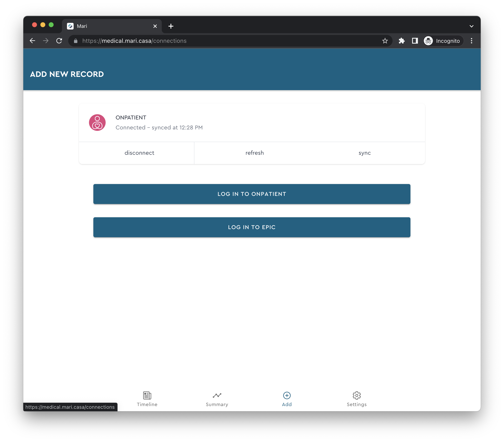

<a name="readme-top"></a>

<style>
   a.disabled {
      pointer-events: none;
      cursor: default;
   }
</style>

<div align="center">
  
  <h3 align="center">Mari Medical</h3>

  <p align="center">
    A self-hosted web app to aggregate and sync all of your medical records from your patient portals in one place. Offline-first with multiple device sync supported. Very much a work in progress.
  </p>
  <p align="center">
    <br />
    <a href="" class="disabled">Demo coming soon</a>
  </p>
</div>

## What is Mari Medical

<p align="center">
  
  
</p>

Mari Medical is a self-hosted web app to aggregate and sync all of your medical records from your patient portals in one place. See everything in a timeline view or quickly summarize your records in one page. Handles multiple user accounts. Offline-first with multiple device sync supported.

## Getting Started

Here are some ways to get Mari Medical running on your local computer

### Docker Compose

```yaml
version: '3.9'

services:
  web:
    image: registry.mari.casa/mari-medical-web:latest
    ports:
      - '4200:80'
  api:
    image: registry.mari.casa/mari-medical-api:latest
    ports:
      - '4201:80'
```

<p align="right">(<a href="#readme-top">back to top</a>)</p>

## Local Development

### Prerequisites

- npm

### Installation

1. Clone the repo
   ```sh
   git clone https://gitea.mari.casa/cfu288/mari-medical.git
   ```
2. Install NPM packages

   ```sh
   npm install
   ```

3. Create `.env` files for each project to run and fill with values

   ```sh
   cp apps/web/.example.env apps/web/.env
   cp apps/api/.example.env apps/api/.env
   ```

4. Serve each one on its own:

   ```bash
   nx serve web
   nx serve api
   ```

   or together as a full app:

   ```bash
   npx nx run-many --target=serve --projects=api,web
   ```

5. Build and serve in docker container:

   ```bash
   npx nx build web
   docker build -t mari-medical-web .
   docker run -d --restart unless-stopped -p 9999:80 mari-medical-web
   ```

6. Push to registry:

   ```bash
   docker tag mari-medical-web:latest registry.mari.casa/mari-medical-web:latest
   docker push registry.mari.casa/mari-medical-web:latest
   ```

<p align="right">(<a href="#readme-top">back to top</a>)</p>
