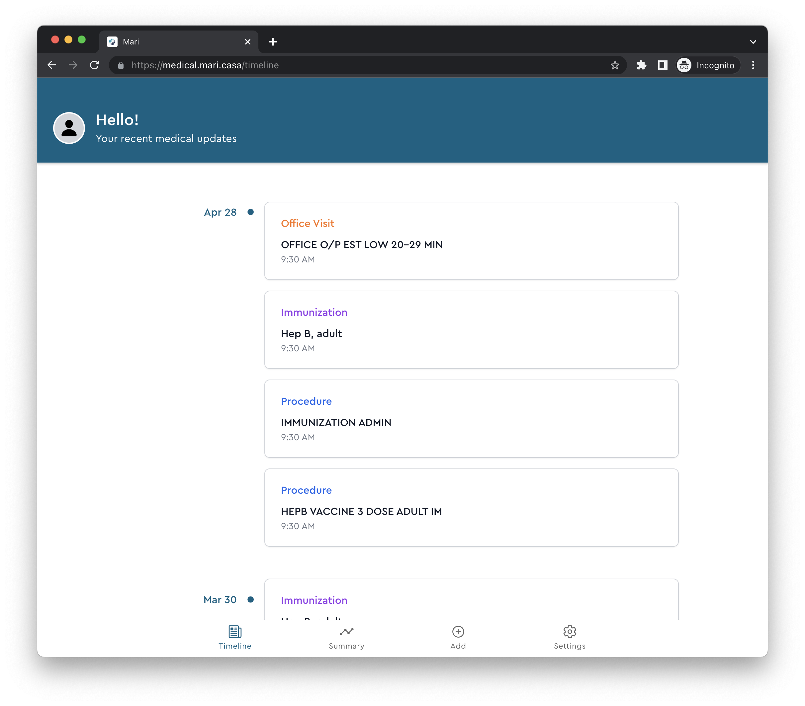

<a name="readme-top"></a>

<div align="center">
  
  <h3 align="center">Mere Medical</h3>

  <p align="center">
    A self-hosted web app to aggregate and sync all of your medical records from multiple patient portals in one place. Privacy focused and offline-first. Currently pre-release software.
  </p>
  <p align="center">
    <br />
    <a href="https://meremedical.co/"><strong>See Docs</strong></a>
    <span> • </span>
    <a href="https://demo.meremedical.co/"><strong>View Demo</strong></a>
  </p>
</div>

<p align="center">
  <a href="https://cloud.digitalocean.com/apps/new?repo=https://github.com/cfu288/mere-medical/tree/main&refcode=f6e0d718edc7">
    
  </a>
</p>
<p align="center">
  <a href="https://drone.mari.casa/cfu288/mere-medical">
    
  </a>
</p>

## What is Mere Medical

<p align="center">
  
</p>

Mere Medical is a self-hosted web app to aggregate and sync all of your medical records from all your doctor and hospital visits in one place. See everything in a timeline view or quickly summarize your records.

## Getting Started

Here are some ways to get Mere Medical running on your local computer

### Docker Compose

```yaml
version: '3.9'

services:
  app:
    image: cfu288/mere-medical:latest
    ports:
      - '4200:80'
    environment:
      - ONPATIENT_CLIENT_ID=${ONPATIENT_CLIENT_ID}
      - ONPATIENT_CLIENT_SECRET=${ONPATIENT_CLIENT_SECRET}
      - EPIC_CLIENT_ID=${EPIC_CLIENT_ID}
      - EPIC_SANDBOX_CLIENT_ID=${EPIC_SANDBOX_CLIENT_ID}
      - CERNER_CLIENT_ID=${CERNER_CLIENT_ID}
      - PUBLIC_URL=${PUBLIC_URL}
```

<p align="right">(<a href="#readme-top">back to top</a>)</p>

## Local Development

### Prerequisites

- npm
- nvm
- Docker

### Installation

1. Clone the repo

   ```sh
   git clone https://github.com/cfu288/mere-medical.git
   ```

2. Set up NPM and install NPM packages

   ```sh
   nvm install v16.14.0
   nvm use
   npm install
   ```

3. Create `.env` files for each project to run and fill with values

   ```sh
   cp apps/api/.example.env apps/api/.env
   ```

   ```sh
   vim apps/web/src/environments/config.json
   ```

4. Serve each one on its own:

   ```bash
   nx serve web
   nx serve api
   ```

   or together as a full app:

   ```bash
   npx nx run-many --target=serve --projects=api,web
   ```

5. Build and serve in docker container:

   ```bash
   docker build -t mere-medical .
   docker run -p 4200:80 -i -t \
     --name mere-medical \
     -e ONPATIENT_CLIENT_ID=<> \
     -e ONPATIENT_CLIENT_SECRET=<> \
     -e EPIC_CLIENT_ID=<> \
     -e EPIC_SANDBOX_CLIENT_ID=<> \
     -e CERNER_CLIENT_ID=<> \
     -e PUBLIC_URL=https://localhost:4200 \
     mere-medical:latest
   ```

<p align="right">(<a href="#readme-top">back to top</a>)</p>
