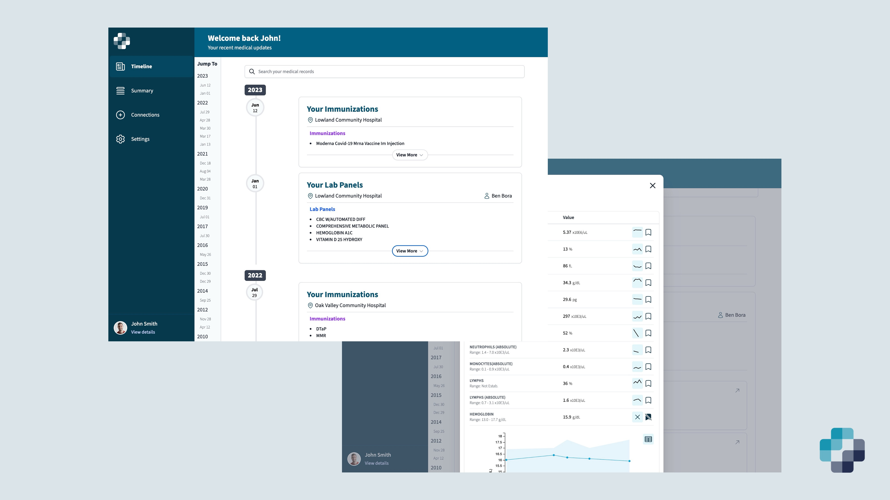
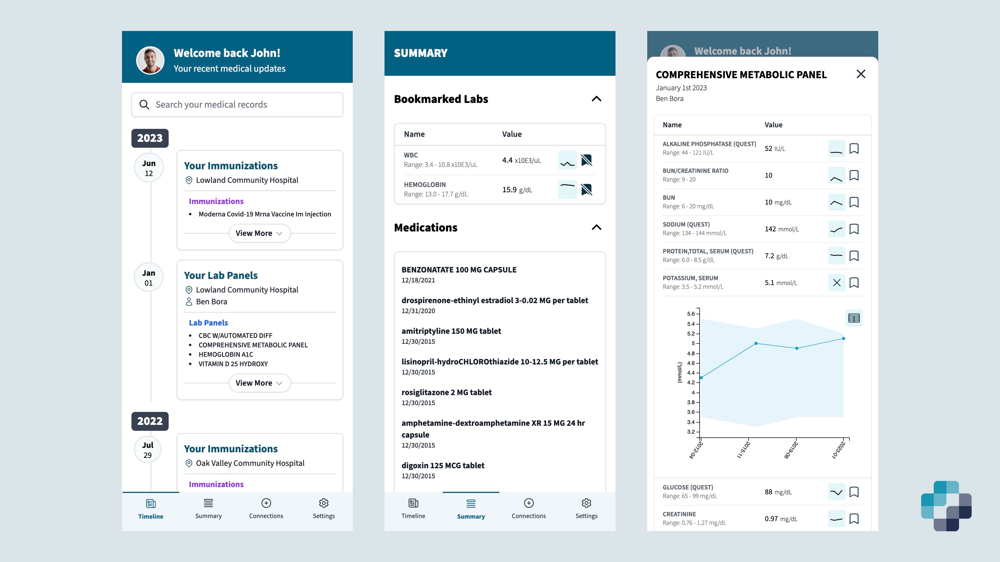

<a name="readme-top"></a>

<div align="center">
  
  <h3 align="center">Mere Medical</h3>
  <p align="center">
    A personal health record to aggregate and sync all of your medical records from multiple patient portals in one place. Currently supports thousands of hospitals and clinics and major electronic medical record systems. Self-hosted, privacy-focused, and offline-first. 
  </p>
</div>

<div align="center">
  <p align="center">
    <br />
    <a href="https://meremedical.co/"><strong>See Docs</strong></a>
    <span> • </span>
    <a href="https://demo.meremedical.co/"><strong>View Demo</strong></a>
  </p>
</div>

<p align="center">
  <a href="https://cloud.digitalocean.com/apps/new?repo=https://github.com/cfu288/mere-medical/tree/main&refcode=f6e0d718edc7">
    
  </a>
</p>
<p align="center">
  <a href="https://discord.gg/FjtQ84qADe">
    
  </a>
  <a href="https://github.com/cfu288/mere-medical/actions/workflows/staging.yaml">
    
  </a>
  
  
  
  
</p>

## What is Mere Medical

<div align="center" >
    
    
</div>

Mere Medical is a self-hosted web app to aggregate and sync all of your medical records from all your doctor and hospital visits in one place. See everything in a timeline view or quickly summarize your records.

> [!NOTE]  
> ~~Mere is currently pre-release software: updates may break backwards compatibility.~~
> Mere has been "pre-release software" since 2022. That probably says more about my fear of committing to an official release than a reflection of Mere. Will avoid breaking backwards compatibility where reasonable.
>
> This project is supported by a single developer who is also a full-time medical resident. If you would like to support this project, please consider [donating](https://github.com/sponsors/cfu288) to help with hosting costs or help by tackling one of the open [issues](https://github.com/cfu288/mere-medical/issues).

> [!NOTE]
> If Mere doesn't fit your needs, another great open-source PHR is [Fasten Health](https://www.fastenhealth.com/)

## Getting Started

Here are some ways to get Mere Medical running on your local computer

### Docker Compose

```yaml
version: '3.9'

services:
  app:
    image: cfu288/mere-medical:latest
    ports:
      - '4200:80'
    environment:
      - ONPATIENT_CLIENT_ID=${ONPATIENT_CLIENT_ID}
      - ONPATIENT_CLIENT_SECRET=${ONPATIENT_CLIENT_SECRET}
      - EPIC_CLIENT_ID=${EPIC_CLIENT_ID}
      - EPIC_SANDBOX_CLIENT_ID=${EPIC_SANDBOX_CLIENT_ID}
      - CERNER_CLIENT_ID=${CERNER_CLIENT_ID}
      - VERADIGM_CLIENT_ID=${VERADIGM_CLIENT_ID}
      - PUBLIC_URL=${PUBLIC_URL}
```

<p align="right">(<a href="#readme-top">back to top</a>)</p>

## Local Development

### Prerequisites

- npm
- nvm
- Docker
- nx

### Installation

1. Clone the repo

   ```sh
   git clone https://github.com/cfu288/mere-medical.git
   ```

2. Set up NPM and install NPM packages

   ```sh
   nvm install v20.11.0
   nvm use
   npm install
   ```

3. If Nx is not installed, install it

   ```sh
   npm i nx -g
   ```

   if you are prompted to run migrations, run the following:

   ```sh
   npx nx migrate --run-migrations
   ```

4. Create `.env` files for each project to run and fill with values

   ```sh
   cp apps/api/.example.env apps/api/.env
   ```

   ```sh
   vim apps/web/src/environments/config.json
   ```

5. Generate localhost ssl certs

   ```
   mkdir -p .dev/certs
   mkcert -key-file .dev/certs/localhost-key.pem -cert-file .dev/certs/localhost.pem localhost
   mkcert -install
   ```

6. Serve each one on its own:

   ```bash
   npx nx serve web
   npx nx serve api
   ```

   or together as a full app:

   ```bash
   npx nx serve-all
   ```

   Alternatively:

   ```bash
   npx nx run-many --target=serve --projects=api,web
   ```

7. Run e2e tests

   ```bash
   npx nx run web-e2e:e2e
   ```

8. Build and serve in docker container:

   ```bash
   docker build -t mere-medical .
   docker run -p 4200:80 -i -t \
     --name mere-medical \
     -e ONPATIENT_CLIENT_ID=<> \
     -e ONPATIENT_CLIENT_SECRET=<> \
     -e EPIC_CLIENT_ID=<> \
     -e EPIC_SANDBOX_CLIENT_ID=<> \
     -e CERNER_CLIENT_ID=<> \
     -e VERADIGM_CLIENT_ID=<ID_HERE> \
     -e PUBLIC_URL=https://localhost:4200 \
     mere-medical:latest
   ```

<p align="right">(<a href="#readme-top">back to top</a>)</p>

## Design Goals

1. Respect user autonomy and user control.
2. Prioritize privacy/security and UX - if those are in conflict, ask the user what they would prefer but default to security.
3. Be transparent about decisions on data storage, handling, and usage.
4. Where feasible, build features to be local first (run on the users device). This essentially means client side/offline first. Mere's core functionality should continue to work without any internet connection.
5. For features that cannot be client-side, enable users to self-host server side functionality where feasible. This means that the user should be able to run Mere on their own server and not rely on a third party.
6. Optionally fall back to third party services when self-hosting is not feasible. Should only apply to features that are not core functionality and should always be opt-in.

<p align="right">(<a href="#readme-top">back to top</a>)</p>
