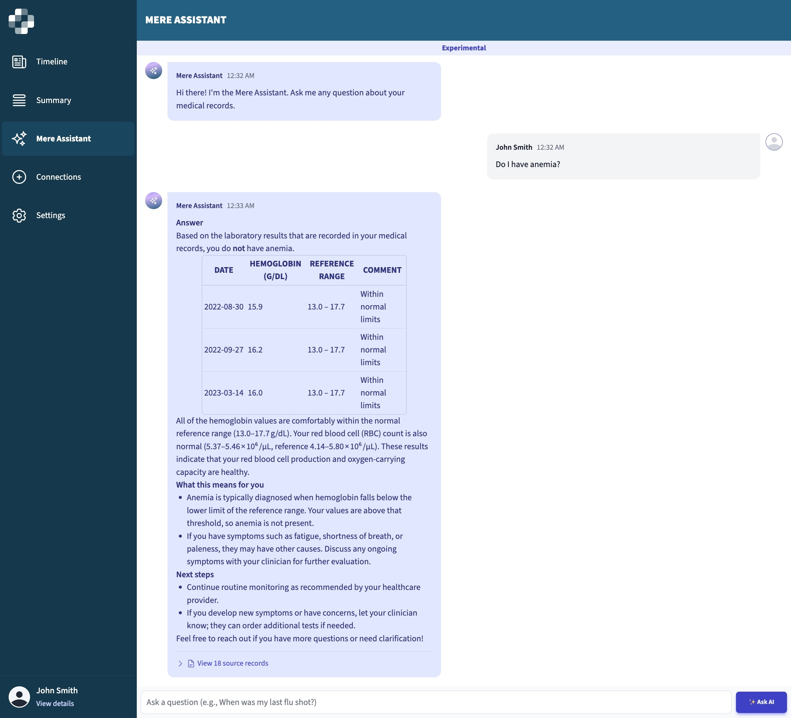

# AI Features to Help you Explore your Health Data

Mere Medical supports optional AI-powered features to help you explore your health records more naturally:

1. Semantic Search – finds relevant records even if you don’t use the exact keyword.

2. Mere Assistant (Q&A) – lets you ask questions in plain language and get direct answers.

To power these new features, we offer you two ways to "plug in" AI models to Mere. You can select from using either configure Mere to use:

1. Local models with Ollama (recommended) – runs fully on your computer, private and offline.

2. Cloud providers (e.g., OpenAI) – quick to set up if you already have an API key.

:::warning Privacy Considerations

I would strongly recommend you configure mere to use Ollama, which runs entirely on your local machine. All data processing stays local.

If you choose to use OpenAI as your LLM provider, your medical data will be sent to OpenAI's servers for processing. Use this option only for testing with non-sensitive data. Would only recommend this for non-medical data or testing purposes.

:::



## Prerequisites

Before enabling AI features, ensure you have:

- Mere Medical running
- For OpenAI: An [OpenAI API key](https://help.openai.com/en/articles/4936850-where-do-i-find-my-api-key)
- For Ollama: [Ollama](https://ollama.com) installed on your local machine

## Accessing AI Settings

Show the AI settings (they’re hidden by default)

1. Open the Settings tab in Mere Medical

2. Scroll to the bottom

3. Turn on **"Show experimental features"** features

4. The AI configuration options will now appear under this tab.

## Option 1: Local setup with Ollama (recommended)

### Step 1: Install & prepare Ollama

1) Install from [ollama.com](https://ollama.com)

2) Pull the models you want:

**Chat models** (choose one):

```bash
ollama pull gpt-oss:20b
ollama pull deepseek-r1:14b
ollama pull qwen2.5:14b-instruct   # default
ollama pull qwen2.5:32b-instruct   # larger
```

**Embedding models** (choose one):

```bash
ollama pull mxbai-embed-large      # default
ollama pull nomic-embed-text
ollama pull dengcao/Qwen3-Embedding-4B:Q4_K_M   # larger
```

3) **(Optional) Reranking models** (choose one):

```bash
ollama pull qwen2.5:3b              # faster
ollama pull qwen2.5:7b              # more accurate
```

4) **(Optional) Increase context window** (per model):

```bash
ollama run gpt-oss:20b
>>> /set parameter num_ctx 8192
>>> /bye
# repeat for each chat model you use

# if using reranking:
ollama run qwen2.5:3b
>>> /set parameter num_ctx 32768
>>> /bye
# or:
ollama run qwen2.5:7b
>>> /set parameter num_ctx 32768
>>> /bye
```

5) Then start the server:

```bash
ollama serve
```

## Option 2: OpenAI (testing only)

:::caution Privacy Warning
Sends your data to OpenAI; recommended for non-sensitive testing only.
:::

1) Create an account at [platform.openai.com](https://platform.openai.com) → generate an API key

2) In Mere Settings, enable "Show experimental features" → enable "Mere Assistant" → select "OpenAI" → paste your key

## Using the AI Features

### Semantic Search

1) Go to the Timeline tab
2) Use the search bar; semantic search will surface related content

Try: "high blood sugar", "breathing problems", "heart issues"

### Mere Assistant (Q&A)

1) Open the Mere Assistant tab
2) Ask about your records

Try:
- "What were my last cholesterol levels?"
- "Do I have any allergies listed?"
- "When was my last physical exam?"

## Troubleshooting (Ollama)

Make sure Ollama is running:
```bash
ollama list
```

Check the endpoint in your browser: `http://localhost:11434`

Test the API:
```bash
curl http://localhost:11434/api/tags
```

Ensure your firewall isn't blocking port 11434; check browser console for CORS errors.

You can also use **Test Connection** in Mere settings.
