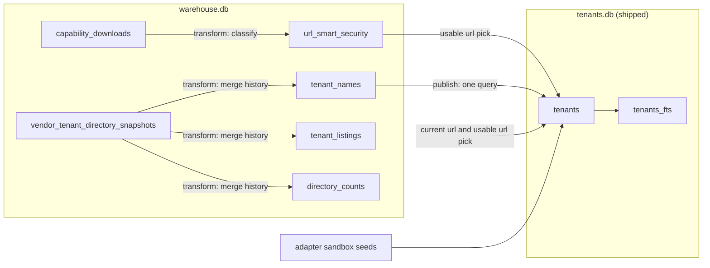

# emr-pipeline

Build-time ETL that turns vendor EMR directories into `libs/tenant-db/data/tenants.db`.

```
vendor APIs / files ──▶ warehouse.db ──▶ tenants.db ──▶ apps/api ──▶ apps/web
     (extract)          (state+staging,     (committed,    (SQL, FTS)   (frozen HTTP
                         gitignored)       ~13.5 MiB)                  contract)
```

```
nx run emr-pipeline:extract
nx run emr-pipeline:transform
nx run emr-pipeline:publish
nx run emr-pipeline:status
```

Only `extract` fetches tenant EMR data using a network. `transform` and `publish` are
pure functions of `data/warehouse.db`; the artifact never depends on a previous
`tenants.db`. The monthly refresh workflow (`.github/workflows/emr-pipeline.yaml`)
runs all three, opens a PR with the regenerated `tenants.db`, and comments the status
output on it; that human review is the quality gate, not checks inside the pipeline.

Each adapter ships its directory URL as a default, so a bare `extract` crawls every
configured pipeline; `*_ENDPOINTS_URL` variables override them (see `src/adapters/`).
Three variables carry meaning beyond an override:

| variable                    | value                                                                                                                   |
| --------------------------- | ----------------------------------------------------------------------------------------------------------------------- |
| `EPIC_CLIENT_ID`            | DCR-authorized Epic client id; unlocks per-tenant register urls in metadata                                             |
| `VERADIGM_R4_ENDPOINTS_URL` | no default; `https://open.platform.veradigm.com/fhirendpoints/download/R4?endpointFilter=Patient` turns the R4 crawl on |
| `HEALOW_R4_FILE_LOCATION`   | path to an eCW practice bundle on disk                                                                                  |

Healow reads eClinicalWorks' public practice list by default
(`https://fhir.eclinicalworks.com/ecwopendev/external/practiceList`, ~15 MB, 17,274
practices). Set `HEALOW_R4_FILE_LOCATION` to read a bundle from disk instead, which is
what the vendor libs used to do.

Veradigm's R4 directory lists 21 practice ids on two or three different FHIR base urls.
A tenant id must identify exactly one endpoint, so `transform` drops any id a directory
lists at conflicting urls (and counts it); the other ~1,693 publish normally. The web
app still connects Veradigm over DSTU2 only.

Epic's Brands bundle is ~90 MB and Athena's is ~132 MB, so a run peaks around 1.3 GB of
heap and the directory fetch gets its own multi-minute timeout.

`data/warehouse.db` is gitignored; the workflow persists it as a rolling
`warehouse-backup` release asset.

## Data flow

1. **Discover.** Each adapter reads its vendor directory and yields candidate tenants.
   An accepted directory body is saved into `vendor_tenant_directory_snapshots`, the history that
   remembers every tenant ever listed; a body identical to the newest snapshot only
   updates that snapshot's date.
2. **Extract.** Fetches the CapabilityStatement of every currently listed tenant, each
   run, through a bounded worker pool with retries and timeouts. A failure, including
   a 200 carrying non-JSON or a capability that classifies unusable, updates error
   columns only. It **never replaces a usable body with an unusable one**: a run
   killed midway costs a re-crawl, never data.
3. **Transform.** `DELETE` + `INSERT` rebuilds the staging tables by rereading every
   snapshot: every tenant ever listed, its latest url and seen date, its last
   non-empty name, every url it was ever listed at, and a classification of each url's
   stored capability body. Pure, offline.
4. **Publish.** One query over the staging tables writes a fresh `tenants.db`: entries
   joined to their usable capability (preferring the current url, else the most
   recently seen url that still classifies usable), plus code-seeded sandbox rows stamped
   with the newest snapshot's time. Publishing twice from the same warehouse yields the
   same artifact.

Failure semantics: **partial failure degrades to staleness, never absence**. Transform
reads the last-known-good body per URL, and a run killed midway publishes what a
completed run over the same bodies would.

Every row carries `last_seen_in_directory` and no row ever leaves the artifact. Nothing
in this repo turns that timestamp into an expiry: search and `findTenantById` serve every
row however old its seen date, so delisted tenants stay reachable and connected users'
sync never breaks. If hiding long-delisted tenants ever matters, that becomes a filter
in the API reading the column, not pipeline state.

## Guardrails

Extract rejects only a directory that contradicts itself: an unparseable body, an empty
yield, or a declared `total` its entries do not match. A rejected directory is never
parsed into the staging tables and advances no seen date.

Publish has no checks of its own: the artifact ships whatever the warehouse holds, and
the monthly PR's status comment is where a human catches a bad refresh.

## Schema

The DDL lives in `src/db/sql/warehouse.sql` (durable), `src/db/sql/staging.sql`
(disposable, dropped and rebuilt), and `libs/tenant-db/src/lib/schema.ts` (the shipped
artifact, `user_version`-asserted at open). `tenants.db` and the staging tables are never
migrated; they regenerate from the durable tables. The durable state is what extract
learns: downloaded capability bodies and the directory history. Losing the warehouse costs a recrawl plus
the memory of tenants no directory lists anymore.

Conventions: every timestamp is an ISO-8601 UTC instant written by the
pipeline's own clock, so text order is time order. Empty strings are never
stored; blank input becomes NULL. Every warehouse table is scoped by
`(vendor, fhir_version)` and scopes never join to each other. The staging
layer declares no foreign keys; transform rebuilds a scope wholesale in one
transaction, so orphans cannot survive a rebuild. Sandbox rows use reserved
`sandbox_`-prefixed ids, and athena ships none.

The published values derive from the tables above by three rules. A tenant's
current listing is its newest `tenant_listings` row (ties broken by highest id).
Its name and managing organization each come from the newest snapshot where that
column was non-empty. Its auth urls come from its usable capability rows, current
url first, then newest sighting, all three urls taken from one row.


How rows move between the tables and across the two databases:



## Design decisions

| Decision                                  | Why                                                                                                                                                         |
| ----------------------------------------- | ----------------------------------------------------------------------------------------------------------------------------------------------------------- |
| Commit `tenants.db` as a binary           | ~2.7 MB/commit gzipped; Git LFS bills the repo owner and a blocked pull breaks `docker build` with a pointer file. DVC, Dolt, and sqlite-diffable rejected. |
| One capability table, upsert-in-place     | Capability bodies need no version history; only directory bodies do, and those live in `vendor_tenant_directory_snapshots`.                                 |
| No ORM; free functions + prepared SQL     | The hot query is FTS `MATCH`; bulk upserts and `INSERT…SELECT` are where ORMs are weakest.                                                                  |
| FTS prefix match, no fuzzy fallback       | Typo tolerance traded for ranked ~1.5 ms search; a misspelling returns nothing rather than a guess.                                                         |
| Directory wins FHIR-version disagreements | The URL is version-specific; the server's claim is recorded as data, and a mismatch is a data-quality query.                                                |
| Don't collapse DSTU2/R4 tenant identity   | 1,168 Cerner ids legitimately exist in both versions, so `fhir_version` is part of the tenant key.                                                          |
| Single-instance vendors are not rows      | `tenants` holds rows a user selects between; one-endpoint vendors (VA, OnPatient, NextGen) stay as literals in `fhir-oauth`.                                |
| Retention: keep every downloaded body     | Pruning before sizes are measured defeats the store's purpose; no `prune` command exists yet.                                                               |

## Accepted limits

- Two extract runs of one scope in the same millisecond would collide on the
  snapshot uniqueness key and abort. Fine for a monthly job.
- The artifact rename and the `publications` insert are two steps across two
  databases; a crash between them ships an artifact whose history row only
  arrives with the next publish.
- A vendor reassigning a url from a delisted tenant to a new one would hand
  the old tenant the new owner's auth urls. Base urls are tenant-specific for
  every vendor except athena's deliberately shared one.
- Publishing twice from one warehouse yields identical rows and ids because
  inserts are ordered, though file bytes may differ.
