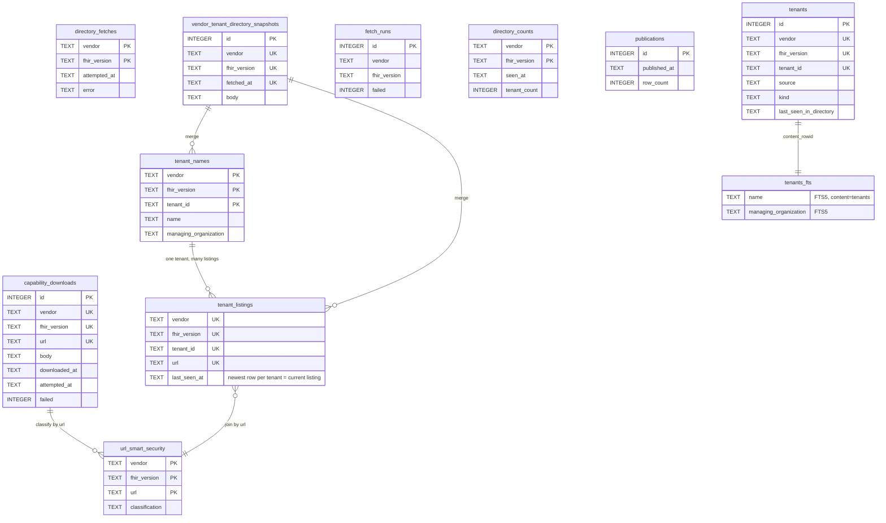
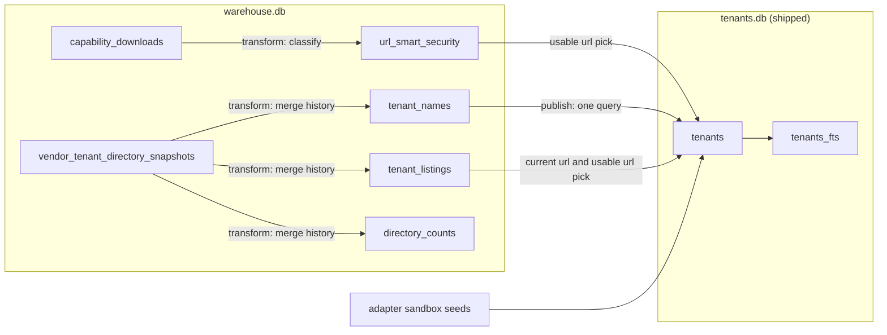

# emr-pipeline

Build-time ETL that turns vendor EMR directories into `libs/tenant-db/data/tenants.db`.

```
vendor APIs / files ──▶ warehouse.db ──▶ tenants.db ──▶ apps/api ──▶ apps/web
```

```
nx run emr-pipeline:extract
nx run emr-pipeline:transform
nx run emr-pipeline:publish
nx run emr-pipeline:status
```

Only `extract` uses the network. `transform` and `publish` read nothing but
`data/warehouse.db`. The monthly workflow (`.github/workflows/emr-pipeline.yaml`)
runs all three, opens a PR with the regenerated `tenants.db`, and comments the
status report on it.

Extract reads its configuration from environment variables. Each crawl needs
its `<VENDOR>_<VERSION>_ENDPOINTS_URL`, plus `EPIC_CLIENT_ID`, sent as the
`Epic-Client-ID` header so Epic includes each tenant's `register` url. Extract
fails if one is missing. Production values live in the workflow's `env` block.
To run locally, copy that block into the repo `.env`, which nx loads. Two
variables are optional. `VERADIGM_R4_ENDPOINTS_URL` turns the Veradigm R4 crawl on,
and `HEALOW_R4_FILE_LOCATION` reads healow's practice list from a file instead
of downloading it.

The directory downloads are large, ~90 MB for Epic and ~132 MB for athena, so a
run peaks around 1.3 GB of heap. The workflow keeps the gitignored
`data/warehouse.db` as the `warehouse` release asset. Each run restores it,
and only a run that publishes uploads it back.

## Data flow

1. **Discover.** The discover step downloads each vendor and version's tenant
   directory with a single HTTP GET. The directory is a JSON FHIR Bundle
   listing every tenant, but each vendor lays out ids, names, and urls
   differently (Epic uses `Endpoint` resources, cerner and healow pair
   `Organization` with `Endpoint`, athena tags `Organization`s with a practice
   extension), so each vendor has its own `parseDirectory` adapter. When the
   body parses, yields tenants, and matches its declared total, discover
   stores it verbatim as one JSON text column in
   `vendor_tenant_directory_snapshots` (vendor, fhir_version, fetched_at,
   body). Splitting it into columns is transform's job. When a refetch returns
   an identical body, discover only updates the newest snapshot's date.
2. **Extract.** The extract step downloads each tenant's CapabilityStatement,
   the JSON document that declares the tenant's OAuth urls, with one HTTP GET
   of `{url}/metadata`. `capability_downloads` keeps one row per url. On
   success, extract overwrites the row's `body` and `downloaded_at`. On a
   failure, a non-JSON 200, or a body that would replace a usable one with an
   unusable one, extract writes only `attempted_at`, `failed`, and `error`.
   Extract writes each row as its fetch finishes, so a killed run keeps
   everything already fetched.
3. **Transform.** The transform step runs offline. It rereads every stored
   snapshot body oldest to newest through the vendor's adapter and rebuilds
   the three staging tables with `DELETE` + `INSERT`. `tenant_names` gets each
   tenant's merged name and managing organization. `tenant_listings` gets one
   row per tenant and url, with the newest date that listed it.
   `url_smart_security` gets each url's authorize, token, and register urls
   read from its stored capability body, plus a classification.
4. **Publish.** The publish step joins the staging tables in one query, using
   the derivation rules below, and writes a brand-new `tenants.db`. Each row
   is one publishable tenant. The adapters' fixed sandbox rows are added,
   stamped with the newest snapshot time.

Delisted tenants stay reachable and connected users keep syncing, because
rows never leave the artifact and readers ignore how old
`last_seen_in_directory` is. Any future expiry belongs in the API as a filter
on that column.

## Schema

The DDL lives in three files. `src/db/sql/warehouse.sql` holds the durable
tables, `src/db/sql/staging.sql` the staging tables, and
`libs/tenant-db/src/lib/schema.ts` the shipped artifact, whose `user_version`
the reader asserts at open. Nothing is migrated. Staging and `tenants.db`
regenerate from the durable tables. Losing the warehouse means recrawling
everything and losing the record of delisted tenants.

Timestamps are ISO-8601 UTC from the pipeline clock, so text order is time
order. Blank input becomes NULL, never an empty string. Every warehouse table
is scoped by `(vendor, fhir_version)` and scopes never join. Staging has no
foreign keys because transform rebuilds a whole scope in one transaction.
Sandbox rows use `sandbox_`-prefixed ids, and athena has no sandbox row.

Derivation rules:

1. A tenant's current listing is its newest `tenant_listings` row, ties broken
   by highest id.
2. Its name and managing organization each come from the newest snapshot where
   that column was non-empty.
3. Its auth urls come together from one usable `url_smart_security` row,
   preferring the current url's and falling back to the most recently listed
   url that has one.



How rows move across the two databases:


