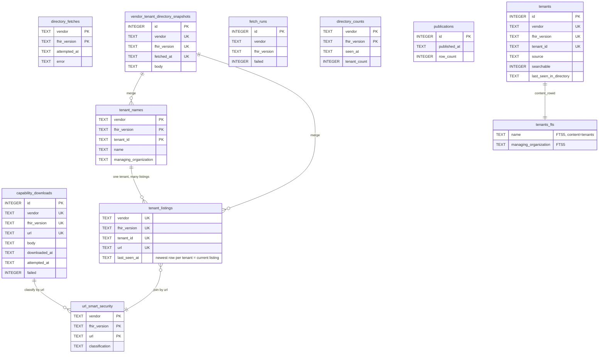
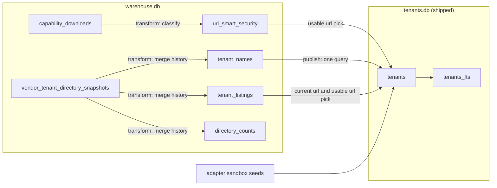

# emr-pipeline

Build-time ETL that turns vendor EMR directories into `libs/tenant-db/data/tenants.db`.

```
vendor APIs / files ──▶ warehouse.db ──▶ tenants.db ──▶ apps/api ──▶ apps/web
     (extract)          (state+staging,     (committed,    (SQL, FTS)   (frozen HTTP
                         gitignored)       ~13.5 MiB)                  contract)
```

```
nx run emr-pipeline:extract
nx run emr-pipeline:transform
nx run emr-pipeline:publish
nx run emr-pipeline:status
```

Only `extract` uses the network. `transform` and `publish` read nothing but
`data/warehouse.db`. The monthly workflow (`.github/workflows/emr-pipeline.yaml`)
runs all three, opens a PR with the regenerated `tenants.db`, and comments the
status report on it.

Extract reads its configuration from environment variables. Each crawl needs
its `<VENDOR>_<VERSION>_ENDPOINTS_URL`, plus `EPIC_CLIENT_ID`, sent as the
`Epic-Client-ID` header so Epic includes each tenant's `register` url. Extract
fails if one is missing. Production values live in the workflow's `env` block.
To run locally, copy that block into the repo `.env`, which nx loads. Two
variables are optional. `VERADIGM_R4_ENDPOINTS_URL` turns the Veradigm R4 crawl on,
and `HEALOW_R4_FILE_LOCATION` reads healow's practice list from a file instead
of downloading it.

The directory downloads are large, ~90 MB for Epic and ~132 MB for athena, so a
run peaks around 1.3 GB of heap. The workflow saves the gitignored
`data/warehouse.db` between runs as the rolling `warehouse-backup` release
asset.

## Data flow

1. **Discover.** One HTTP GET per vendor and version downloads its tenant
   directory, a JSON FHIR Bundle listing every tenant. Each vendor lays out
   ids, names, and urls differently (Epic uses `Endpoint` resources, cerner and
   healow pair `Organization` with `Endpoint`, athena tags `Organization`s with a
   practice extension), so each vendor has a `parseDirectory` adapter. A body that
   parses, yields tenants, and matches its declared total is written verbatim as
   one JSON text column in `vendor_tenant_directory_snapshots` (vendor,
   fhir_version, fetched_at, body). Nothing is split into columns here; that is
   transform's job. Refetching an identical body only updates the newest
   snapshot's date.
2. **Extract.** For every tenant url in the directory, one HTTP GET of
   `{url}/metadata` downloads its CapabilityStatement, the JSON document that
   declares the tenant's OAuth urls. `capability_downloads` keeps one row per
   url. A success overwrites the row's `body` and `downloaded_at`. A failure, a
   non-JSON 200, or a body that would replace a usable one with an unusable one
   writes only `attempted_at`, `failed`, and `error`. Rows are written as
   fetches finish, so a killed run keeps everything already fetched.
3. **Transform.** Offline. Rereads every stored snapshot body oldest to newest
   through the vendor's adapter and rebuilds the three staging tables with
   `DELETE` + `INSERT`. `tenant_names` gets each tenant's merged name and
   managing organization. `tenant_listings` gets one row per tenant and url,
   with the newest date that listed it. `url_smart_security` gets each url's
   authorize, token, and register urls read from its stored capability body,
   plus a classification.
4. **Publish.** One query joins the staging tables by the derivation rules
   below and writes a brand-new `tenants.db`. Each row is one publishable
   tenant, plus the adapters' fixed sandbox rows stamped with the newest
   snapshot time.

Rows never leave the artifact, and readers ignore how old
`last_seen_in_directory` is, so delisted tenants stay reachable and connected
users keep syncing. Any future expiry belongs in the API as a filter on that
column.

## Guardrails

Extract rejects a directory body that does not parse, lists no tenants, or
declares a total its entries do not match. A rejected body is not saved, so it
never reaches staging. Publish has no checks of its own. The human reviewing
the monthly PR's status comment is the gate.

## Schema

The DDL lives in three files. `src/db/sql/warehouse.sql` holds the durable
tables, `src/db/sql/staging.sql` the staging tables, and
`libs/tenant-db/src/lib/schema.ts` the shipped artifact, whose `user_version`
the reader asserts at open. Nothing is migrated. Staging and `tenants.db`
regenerate from the durable tables. Losing the warehouse means recrawling
everything and losing the record of delisted tenants.

Timestamps are ISO-8601 UTC from the pipeline clock, so text order is time
order. Blank input becomes NULL, never an empty string. Every warehouse table
is scoped by `(vendor, fhir_version)` and scopes never join. Staging has no
foreign keys because transform rebuilds a whole scope in one transaction.
Sandbox rows use `sandbox_`-prefixed ids, and athena has no sandbox row.

Derivation rules:

1. A tenant's current listing is its newest `tenant_listings` row, ties broken
   by highest id.
2. Its name and managing organization each come from the newest snapshot where
   that column was non-empty.
3. Its auth urls come together from one usable `url_smart_security` row,
   preferring the current url's and falling back to the most recently listed
   url that has one.



How rows move across the two databases:



## Design decisions

| Decision                               | Why                                                                                                                                                      |
| -------------------------------------- | -------------------------------------------------------------------------------------------------------------------------------------------------------- |
| Commit binary `tenants.db`             | ~2.7 MB/commit gzipped. Git LFS bills the repo owner, and a blocked pull breaks `docker build` with a pointer file. DVC, Dolt, sqlite-diffable rejected. |
| One capability table, upsert-in-place  | Only directory bodies need history (`vendor_tenant_directory_snapshots`).                                                                                |
| No ORM. Free functions + prepared SQL  | FTS `MATCH`, bulk upserts, `INSERT…SELECT` fit poorly in ORMs.                                                                                           |
| FTS prefix matching, no fuzzy fallback | Ranked ~1.5 ms search. Misspellings return nothing.                                                                                                      |
| Directory decides FHIR version         | The url is version-specific, so the crawl scope is the truth. The server's own version claim is not stored.                                              |
| Separate DSTU2/R4 identities           | 1,168 Cerner ids span both. Tenant keys include `fhir_version`.                                                                                          |
| Exclude single-instance vendors        | `tenants` contains selectable tenants. VA, OnPatient, NextGen endpoints remain `fhir-oauth` literals.                                                    |
| Retain every downloaded body           | Measure sizes before pruning. No `prune` command yet.                                                                                                    |

## Accepted limits

- Same-scope extracts in the same millisecond collide on snapshot uniqueness and
  abort. Fine for a monthly job.
- Artifact rename precedes `publications` insertion across databases. An intervening
  crash ships the artifact without history until next publish.
- Reassigned urls give delisted tenants the new owner's auth urls. Vendor base
  urls are tenant-specific except athena's intentionally shared one.
